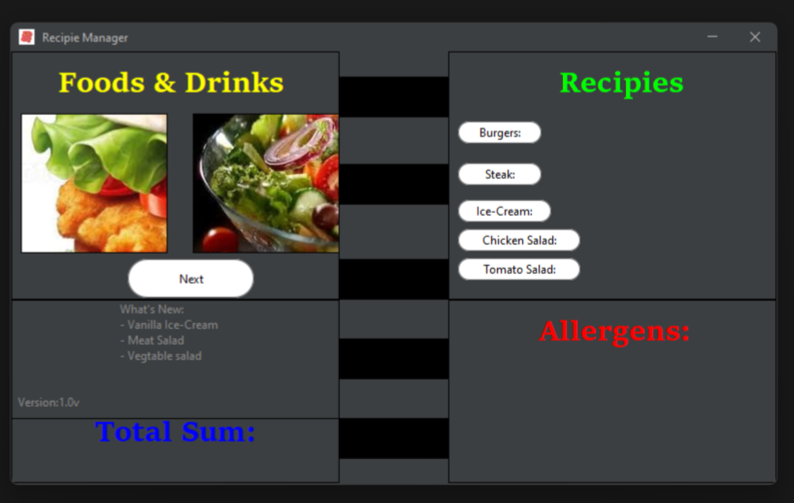
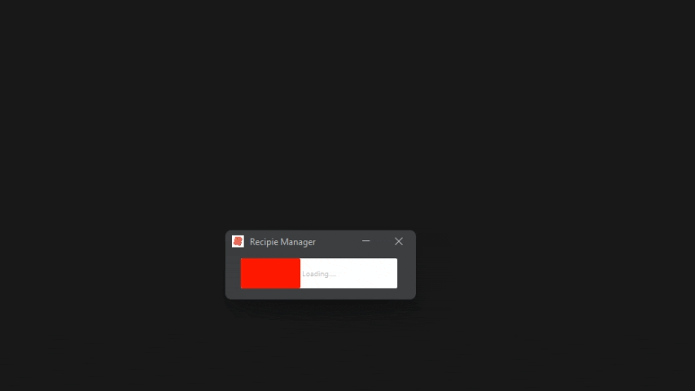
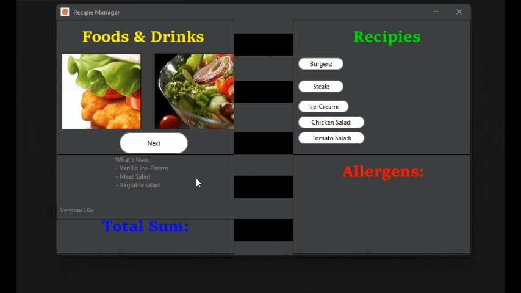
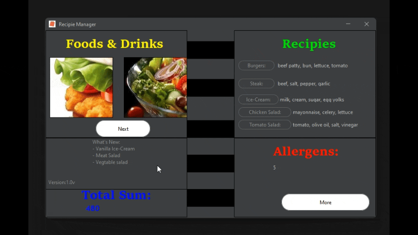
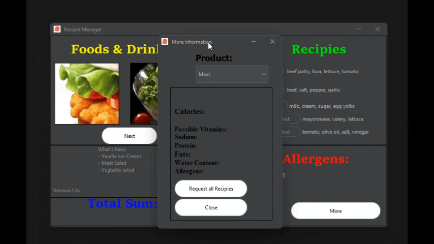
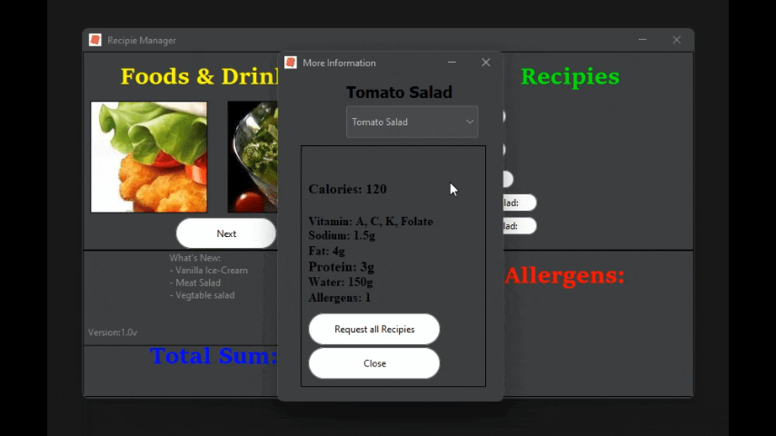

FINAL UPDATE OF DECEMBER 10 2025:
                           the person still has not contacted, I finally consider this project ended and fully complete.

UPDATE AS OF DECEMBER 3 2025 16:49:
                    the person who contacted me has not reached or contacted again for full 24 days (almost 25).
I can consider this project finished and closed. Working on this project gave me some more experience.

NOVEMBER 22 2025:

RecepieManager App in Java

This is a new Java Project that I have started. It's about building a Recepie Manager App.

This idea itself is not originally coming from me, but it all started when one person from a Discord was in need to build an App as a School Project. They addressed sort of "Java helping Community", so I decided to help them and also it kind of "boosts" my experience.
The App itself is mostly made of In-Built Java Swing Framework, but it uses Java AWT as well.
RecepieManger App lets the User (Non-Server related Client) pick a Meat, Burger, Ice-Cream and calculate total price, and also generate some Allergen data and amount too.
It produces some button click sound, it has images in it even if Jar file is exported (I fixed that issue of Jar file not containing image inside whenever you run it).
Following App (Project) does not use any Databases since it's a casual, small School project, and tiny PrintStream usage was enough to handle this.
Preparation for this Project originally started on October 4th, but development started shortly after (October 10th) and has continued until the Middle of October, even if it was a Project finishing date.
But this does not mean it is finished; changes and improvements are about to undergo.

* Demonstrational features 👇
* Design 🍥:

* Startup loading bar 📶:
  
* Choose food products 🍔:
  
* Automatic Screen Cleanup 🧽:
  
* More Information Tab 📜:
  
* Sneaky Close Button Effect 📕:
  
