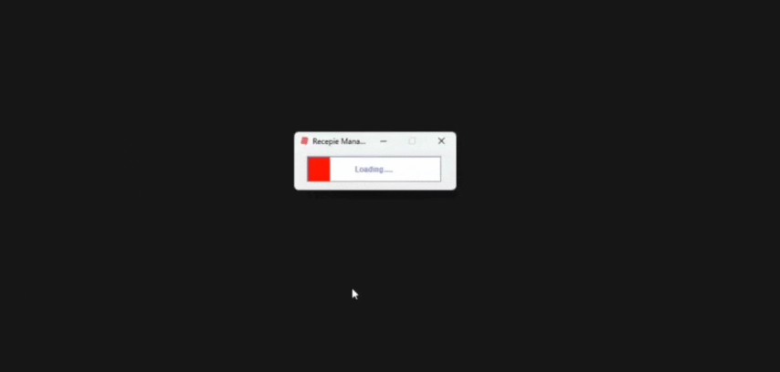

  *UPDATE AS OF DECEMBER 3 2025 16:48*: \the person who contacted me has not reached or contacted again for full 24 days (almost 25). I can consider this project finished and closed. working on this Project gave me some more experience.

   NOVEMBER 22 2025:
  *RecepieManager App in Java*
This is a new Java Project that I have started, its about building a Recepie Manager App. this idea itself is not originally comming from me, but it all started when one person from a Discord was in need to build App as an School Project so They addressed sort of "Java helping group', so I decided to help them and also it kind of 'boosts' my experience.
App itself is mostly made of In-Built Java Swing Framework, but it uses Java AWT as well. By some possible chance it may also has JGoodies if I am not wrong.
RecpieManger App lets User (Non-Server related Client) to pick a Meat, Burger, Ice-Cream and calculate total price and also generate some Allergen data and amount too. It produces some button click sound, it has images in it even if Jar file is exported (I fixed that issue of Jar file not containing imagine inside whenever you run it).
Following App (Project) does not uses any Databases since its a casual, small School project and Java IO Operations where enough to handle this.
Preparation for this Project originally started on October 8th, But development started shortly after (October 10th) and has continued until Middle of the October, even if it was a Project finishing date. but this does not mean It is finished, Changes and improvments are about to undergo.

* Demonstrational features 👇
* Design 🍥:

* Startup loading bar 📶:
  
* Automatic Screen Cleanup 🧽:
  
* More Information Tab 📜:
  
